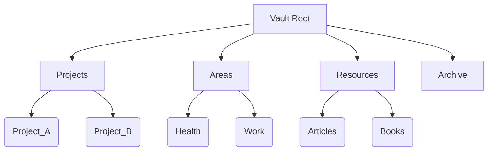
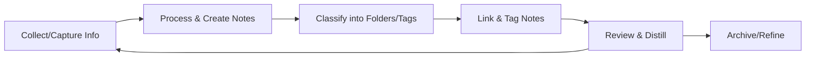

# Executive Summary  
Effective digital knowledge management combines clear file organization with evidence-based note-taking. Cognitive research shows that **spaced retrieval practice** and **active recall** greatly improve memory【25†L71-L79】, and that linking new information to existing knowledge (elaborative encoding) strengthens recall【30†L8-L11】. Our recommended system leverages these principles: we organize files into a simple hierarchy (e.g. Tiago Forte’s PARA categories【35†L103-L113】) and maintain **atomic, interconnected notes** (Zettelkasten-style) to mirror our brain’s associative structure【32†L147-L152】. Obsidian, with its markdown vault and backlinks, is an ideal platform: it supports **templates, daily notes, MOCs (Maps of Content), backlinks, graph views,** and powerful plugins (e.g. Calendar【21†L59-L68】, Dataview【22†L140-L149】, Tasks【22†L158-L167】) to enact this system. The following report compares major note-taking methods (Zettelkasten, PARA, GTD, Cornell, Progressive Summarization) with pros/cons, details file and folder naming/structure best practices, and provides Obsidian-specific guidance. It concludes with a step-by-step implementation plan, migration checklist, maintenance routines, and example folder trees, templates, tables, and mermaid diagrams for an actionable workflow.

## Cognitive Principles of Memory and Learning  
Human memory is **not static**; each retrieval strengthens and reshapes memories【25†L53-L57】.  Research shows *distributed (spaced) practice* combined with *retrieval practice* (self-testing) yields the most durable learning【25†L71-L79】.  For example, spreading study sessions over days (spacing) rather than cramming improves long-term recall【25†L61-L69】【25†L71-L79】.  Likewise, actively recalling information (via quizzes or note review) strengthens memory more than passive review【25†L71-L79】. 

Equally important is **elaboration and linking** of ideas.  “Elaborative encoding” – connecting new facts to existing knowledge or distinctive experiences – is thought to improve recall by creating richer associative cues【30†L8-L11】.  In note-taking, this means writing down ideas in your own words and linking related notes (backlinks), effectively building a web of context.  For example, Zettelkasten and concept maps explicitly harness this by connecting notes into networks, mimicking how concepts are stored in the brain【32†L147-L152】.  In practice, always seek to **process** notes (not just copy) by summarizing, questioning, or relating them to other notes, which deepens understanding and creates retrievable memory cues【30†L8-L11】【25†L71-L79】.

## Comparison of Note-Taking Methods  

| Method                     | Focus & Structure                                                 | Pros                                                        | Cons                                                          | Use Case/When to Use                      |
|----------------------------|-------------------------------------------------------------------|-------------------------------------------------------------|---------------------------------------------------------------|-------------------------------------------|
| **Zettelkasten**           | Atomic notes (one idea per note) with unique IDs and bidirectional links【32†L89-L92】【32†L147-L152】 | Deeply interconnected knowledge base; encourages creative insights; mirrors brain’s associative structure【32†L147-L152】 | High maintenance overhead; steep initial effort; less structured for ad-hoc tasks or meeting notes | Research, writing, long-term learning, building a “second brain” of ideas |
| **PARA (Projects/Areas/Resources/Archives)** | Top-level folders labeled **Projects, Areas, Resources, Archive**【35†L103-L113】, each containing relevant notes/files. | Simple, comprehensive system; aligns with active goals; easily integrates tasks & notes【35†L103-L113】 | Broad categories can blur; requires discipline to file items correctly; flat relative to content semantics | General digital file and note organization; work/project management systems |
| **GTD (Getting Things Done)** | Task-centric workflow: Capture inbox → Clarify actions → Organize into lists (Next, Calendar, Someday, etc.)【57†L161-L169】【57†L172-L180】. Notes used as actionable items or references. | Systematic task management; clears mind by collecting all inputs; weekly review keeps system current【57†L295-L303】【58†L1-L4】 | Not primarily for content synthesis; can become list-heavy; requires regular review to prevent overload | Personal productivity; managing tasks, emails, project to-dos within a notes environment |
| **Cornell Method**         | Page divided: **Notes** section (right), **Cues/Keywords** (left), **Summary** (bottom)【55†L90-L100】. Emphasizes active summarization during note-taking. | Structured layout aids review: prompts self-testing with cues and summaries【55†L90-L100】【55†L110-L119】; boosts comprehension via active summarizing【55†L110-L119】 | Fixed format is rigid; better for handwritten/classroom notes; time-consuming to set up digitally; less flexible for complex linking | Lecture or meeting notes; linear content where summarizing and review questions are beneficial |
| **Progressive Summarization** | Layered highlighting/summary in notes: import content, bold key sentences (layer 2), highlight top points (layer 3), write your own summary at top (layer 4)【42†L363-L370】【42†L400-L408】. | Makes long notes skimmable; “discoverable” by future self; preserves context via layered approach【42†L363-L370】【42†L428-L435】 | Time-consuming process; requires multiple reviews of notes; best for material you’ll revisit repeatedly | Deep reading/research: processing articles, books, or archived notes to distill insights |

Each method has its place. **Zettelkasten** excels in building a knowledge network when you have time to link ideas (e.g. research notes)【32†L147-L152】, whereas **PARA** offers broad, actionable organization for project files【35†L103-L113】. **GTD** is optimal for task/action capture (notes become tasks or references)【57†L161-L169】. **Cornell** is great in educational settings for comprehension and review【55†L90-L100】, but less suited to digital knowledge bases. **Progressive Summarization** augments any system by making notes more retrievable, at the cost of extra review effort【42†L400-L408】.

## File and Folder Organization Best Practices  

**Folder vs. Flat vs. Tags.** A hybrid approach is generally best【10†L252-L261】. Use a **hierarchical folder structure** for broad categories (e.g. major projects, departments, themes) to give a sense of place【10†L275-L282】【10†L285-L287】. For example, top-level folders for Projects, Areas, Resources, Archive (the PARA system【35†L103-L113】) or similar will cover most information. However, a strictly hierarchical system limits each note to one “place.” Supplement folders with **tags/metadata** to allow cross-cutting classification. Tags let notes belong to multiple contexts (e.g. tag a note as both `#idea` and `#meeting`)【10†L294-L302】. Avoid a *purely* flat or tag-only system, which can become chaotic: tags require strict consistency or a tagging “map”【47†L168-L177】. Instead, leverage folders for stable categories and use tags or YAML metadata for flexible labels, status, and attributes.

**Naming Conventions.** Consistent, descriptive file names aid searchability. Use concise names with key information, putting the most important data first【8†L252-L259】. Include dates in ISO `YYYYMMDD` format for chronology【8†L252-L259】. If versioning without a VCS, append a version or date suffix (e.g. `_v1`, `_v2` or `20240115`) to indicate edits【8†L274-L281】. Avoid special characters or spaces in file names (use hyphens or underscores instead)【8†L290-L299】. Keep names readable yet not excessively long【8†L310-L319】. Crucially, document your naming scheme (in a README or wiki) so future you always uses it consistently【8†L310-L319】.  

**Folder Hierarchies.** Deep hierarchies can be rigid; aim for no more than 3–4 levels deep for most content. For files that naturally group (e.g. one folder per project, subfolders by milestones), use folders; for diverse or multi-category content, tags or MOCs (below) help. For example, a research project might be `Projects/Thesis/`, whereas general resource notes live under `Resources/`. Periodically archive or consolidate folders; avoid burying important notes too deep.  

**Tagging and Metadata.** Use **YAML front matter** in markdown files for metadata (aliases, tags, title), which Obsidian can index. Tags (`#tag`) can mark tasks, contexts, or statuses; just maintain a tag reference note or use Tag Wrangler for bulk cleanup【21†L83-L92】. Metadata like `status: draft` can be queried via search or Dataview. Consistent tagging (see Pareto patterns: e.g. a few broad tags) is key to avoid tag sprawl【47†L168-L177】.

**Version Control and Backups.** Always backup your vault. Use an automated solution: cloud sync (Dropbox, OneDrive, iCloud) or Git for version history【17†L1-L9】. For example, Obsidian can store vaults in a cloud-synced folder or use Obsidian Sync (paid). A Git repo (with `.gitignore` for temp files) provides granular versioning. The single most important rule is **offsite copies**: as Box recommends, “fundamental file management” is to back up files, e.g. to an external drive or cloud【3†L185-L193】. Consider weekly backups or continuous syncing.  

**Search Strategies.** Rely on both file-system search and Obsidian’s internal search. Name files with unique keywords so OS-level search can find them. Inside Obsidian, use the global search (Ctrl+F) with operators (`AND`, `OR`, quotes for phrases, `file:`, `path:`, `tag:`)【54†L19-L28】【54†L49-L58】. Learn basic Boolean searches (e.g. `project AND report`, or exclude with `-keyword`). Obsidian’s *Quick Switcher* (Ctrl+O) finds note titles fast. For more advanced queries, the Dataview plugin lets you query note contents and metadata (e.g. list all notes with `status:todo`). Maintain a handful of **index or map notes** (see MOCs below) that link key topics, effectively creating manual “table of contents” for your vault.

**Cross-Platform Considerations.** Use universally-compatible characters and formats. Avoid characters illegal on any OS (no `: * ? ` etc. in names). Markdown files (`.md`) are plain text and work everywhere (Windows, macOS, Linux). If collaborating or switching platforms, test on another OS. Consider line-ending differences (LF vs CRLF) – Git can normalize these. If using attachments or images, relative linking in markdown is portable; just ensure the assets folder structure is consistent across devices. In summary: keep filenames simple, and rely on markdown and plain links so any platform’s tools (even code editors) can open your vault if Obsidian is unavailable.

## Best Practices in Obsidian  

**Vault Structure.** Create one primary vault (a folder) for your personal knowledge base. Within it, use the above PARA-inspired top-level structure (Projects, Areas, Resources, Archive). For example:

```plaintext
MyVault/
├─ Projects/
│   ├─ Project_A/
│   └─ Project_B/
├─ Areas/
│   ├─ Health/
│   └─ Career/
├─ Resources/
│   ├─ Articles/
│   └─ Books/
├─ Archive/
├─ Daily_Notes/
└─ Templates/
```



This structure separates **active work** (Projects, Areas) from reference material (Resources) and historical items (Archive).  You can also keep an `Inbox.md` or quick notes file at root for uncategorized captures.

**Folders vs. Tags in Obsidian.** In Obsidian, folders organize files, while tags (`#tag`) and links weave context. Use folders for the PARA categories as above【35†L103-L113】. Do not banish tags – Obsidian’s Tag Pane lets you see all tags at a glance. For example, tag tasks by status (`#todo`, `#urgent`) or by topic (`#AI`, `#Meeting`). If you find a mess of inconsistent tags, the **Tag Wrangler** plugin can bulk-rename or merge them【21†L83-L92】. Note: do not use Obsidian’s “alias” feature in URLs as a substitute for structured folders; aliases are better for synonyms within notes.

**Templates.** Use the core **Templates** plugin (Settings → Core Plugins → Templates) to create reusable note templates. Common templates:  
- **Daily Note template** (for journaling or tasks each day).  
- **Meeting Notes template** (with sections like *Attendees, Agenda, Notes, Action Items*).  
- **Project template** (fields like start date, end date, status).  
- **Literature/Book Note template** (Title, Author, Key Points, Quotes, Personal Thoughts).  

Put template files (e.g. `templates/daily.md`) in a dedicated Templates folder and configure the plugin to point there. Use placeholders like `{{date}}` to auto-insert the current date. A consistent template ensures each note has standard sections and metadata (e.g. YAML frontmatter with a `tags:` list or `status:` field).

**Daily Notes & Periodic Notes.** Obsidian’s **Daily Notes** (core plugin) automatically creates a note dated today. It’s ideal for journaling daily tasks, thoughts, and logging what you did. Enable it and customize the filename format (e.g. `YYYY-MM-DD`). The **Calendar** community plugin adds a sidebar calendar—clicking a date opens its daily note【21†L59-L68】. The **Periodic Notes** plugin (by the same developer) extends this to weekly, monthly, and yearly notes【21†L73-L81】. Use Daily/Weekly notes for to-dos, a quick log of what you learned, or as a hub linking out to detailed notes you created that day. Tag each daily note or assign it to a “Daily” folder for easy filtering.

**Maps of Content (MOCs).** MOCs are wiki-like “index” pages that list and link related notes. For a given topic or project, a MOC might be named “📋 Project A” and contain links to all notes about Project A. As Obsidian Rocks explains, MOCs “allow you to create first and worry about structure later” and keep track of notes in your “digital garden”【47†L95-L103】【47†L148-L160】. Folders are binary (a note is in one folder), but MOCs let a note appear in multiple thematic maps without duplication【47†L152-L160】. Create MOCs manually as needed: for example, a “Home” MOC linking to major theme MOCs, or a “Fleeting MOC” linking all unsorted notes【47†L124-L133】. Over time, adjust MOCs to reflect how your interests and work flow, deleting obsolete ones. MOCs complement – not replace – folders: use both together【47†L152-L160】.

**Backlinks and Graph View.** Whenever you link a note (using `[[WikiLink]]`), Obsidian automatically shows *Backlinks* (notes that link to the current note) in the sidebar. Use this constantly to discover hidden connections. The **Graph view** (core plugin) visualizes all notes as nodes and their links as edges【49†L1-L9】. It helps you spot clusters, orphaned notes, and gaps in your network. Filters let you focus (e.g. only show recent notes or tags). The graph reinforces linking behavior: more interconnected notes produce a richer graph. While optional, the Graph can inspire questions (“Why is this note isolated?”) and guide where to create links or MOCs.

**Obsidian Plugins (Recommendations & Trade-offs).** Obsidian’s community plugins greatly extend functionality, but each adds complexity. Table below summarizes some key ones:  

| Plugin         | Purpose                              | Benefit                                           | Trade-Off                                 |
|----------------|--------------------------------------|---------------------------------------------------|-------------------------------------------|
| **Calendar**【21†L59-L68】      | Sidebar month view for dates; integrates with Daily Notes | Fast access to daily notes; visual date navigation | Minimal (developer is in Obsidian team)   |
| **Periodic Notes**【21†L73-L81】 | Create/organize monthly, quarterly, yearly notes | Structured time-based notes (journals, reviews)   | Extra setup for each period type          |
| **Tag Wrangler**【21†L83-L92】   | Bulk manage tags: rename, merge   | Keeps tag taxonomy clean; one-click renaming      | Used infrequently (only for maintenance)  |
| **Commander**    | Customize Obsidian UI & commands | Tailor interface (toolbar, menus); create macros   | Setup can be fiddly; not essential to basic use |
| **Dataview**【22†L140-L149】    | Query notes based on metadata and content | Build dynamic tables, lists from your notes (e.g. task lists, summaries) | Steep learning curve; needs strict YAML syntax |
| **Tasks**【22†L158-L167】       | Advanced task management in markdown   | Task queries, scheduling, custom workflows         | Has mental model shift (no inbox); learning required |
| **Charts**【22†L193-L200】      | Create charts/graphs from data in notes   | Embed visual data (e.g. pie, line, radar charts)  | Mostly for data-savvy users; not needed for text notes |
| **Share Note**【22†L212-L223】  | Export a note as a web page with link   | Easy sharing of notes outside Obsidian             | Relies on internet; one-way export        |

Each plugin adds maintenance overhead (updates, conflicts). Start with only **essential** core and community plugins: Calendar, Periodic Notes, and a **Templates** plugin are extremely useful for any workflow【21†L59-L68】【21†L73-L81】. Add Dataview or Tasks once your vault grows large and you need advanced queries. Always weigh the gain vs complexity: e.g. Dataview’s power comes at the cost of time learning its query language【22†L140-L149】, but it can transform static notes into dynamic dashboards.

## Implementation Plan  

**1. Define Structure and Conventions.** Decide on your top-level categories (e.g. PARA) and naming rules. For instance, plan to name files like `YYYYMMDD_Project_Description_v1.md`【8†L252-L259】【8†L274-L281】. Write down this convention in a vault guide note. Create those top-level folders in a new vault (e.g. `Projects`, `Areas`, `Resources`, `Archive`).

**2. Set Up Obsidian Core Features.** Create a new vault (select the root folder). Enable core plugins under **Settings**: *Daily Notes*, *Templates*, *Backlinks*, *Graph View*. Install the recommended community plugins: Calendar, Periodic Notes, Tag Wrangler (via **Community Plugins**). Configure them: point Templates to your templates folder; set Daily Note format (e.g. `YYYY-MM-DD`); assign preferences (first day of week, etc.)【21†L59-L68】【21†L73-L81】.

**3. Create Templates and MOCs.** In the `Templates/` folder, create note templates: a daily note (header with date), a meeting note (sections for attendees/agenda/notes/actions), and a literature note (fields for title, source, summary). At root or `Areas/`, create an initial “Home” MOC or index note linking to major MOCs (e.g. `[[Projects]]`, `[[Areas]]`). Also create a “Fleeting MOC” and add `parent:: [[Fleeting MOC]]` to new-note templates so unsorted notes appear in it【47†L124-L133】.

**4. Migrate Existing Content (if applicable).** If you have notes in other tools:  
   - **Evernote**: Export notebooks as `.enex` (Evernote XML). Use the official Obsidian **Importer** (Settings → Import) to convert the `.enex` into markdown【51†L1-L9】. This preserves note content and tags (though Evernote tag hierarchy may flatten; see importer docs).  
   - **OneNote/PDF/Docs**: Export content to Markdown via available tools (e.g. Pandoc, OneNote Exporter, or copy-paste). Place converted `.md` files into appropriate folders. Use Find/Replace or the Tag Wrangler to fix any formatting or tag issues.  
   - **Other notes**: If coming from simpler apps (e.g. Notepad), you can copy them into Obsidian with minor editing.  
After import, **review**: ensure note links still work, rename any files to match your conventions, and move them into the correct folders.

**5. Establish Workflows and Routines.** Start each day by opening today’s Daily Note (via Calendar or hotkey) and jotting key tasks and notes. Use the **Inbox** (or Daily Note) as your initial capture area – at day’s end or week’s end, process these into project notes or tasks in your structure (a GTD “Clarify” step)【57†L163-L172】【57†L243-L252】. Weekly, perform a **review**: check upcoming tasks (calendar, “Next Actions”) and move or archive items as needed【57†L295-L303】. Update your MOCs: if new notes have no links, add them to appropriate map or tag them.

**6. Maintenance.** Once weekly or monthly, prune and update your vault:  
- Move completed projects to `Archive/`.  
- Collapse or delete obsolete tags (Tag Wrangler can rename obsolete ones to new terms)【21†L83-L92】.  
- Consolidate notes: if two notes overlap heavily, consider merging or linking them.  
- Backup: verify your cloud sync or Git repo is up-to-date (push changes). A monthly manual backup to external storage is a safe habit.  
- Review MOCs: make sure each major topic has an entry point (MOC) with links. If an area has grown too large, split its MOC into sub-topics.  

**7. Iteration and Improvement.** This system will evolve. Feel free to adjust folder names, split large vaults, or adopt new plugins as needs change. For example, some people split “Work Vault” vs “Personal Vault” if contexts are unrelated. Document any major changes in a `System_Design.md` note so future you remembers why the structure exists.

## Examples  

**Example Folder Tree:**  
Below is a sample vault layout following a PARA-like scheme. (Folders 01–04 prefix to sort them, optional.)

```plaintext
MyVault/
├─ 01_Projects/
│   ├─ Website_Redesign/
│   └─ Research_Paper/
├─ 02_Areas/
│   ├─ Health/
│   └─ Career/
├─ 03_Resources/
│   ├─ Articles/
│   └─ Books/
├─ 04_Archive/
│   └─ Old_Projects/
├─ Daily_Notes/
├─ Templates/
└─ Inbox.md
```

**Naming Convention Example:**  
Use a consistent pattern like `YYYYMMDD_Project_Description_vX.md`. For instance:  
- `20260315_MarketResearch_InterviewPrep_v1.md`  
- `20260316_Thesis_LiteratureSummary_v2.md`  
This sorts chronologically and includes context.

**Note Template Snippet:**  
A meeting note template (`Templates/Meeting.md`):

```markdown
---
date: {{date}}
attendees: 
tags: [Meeting, {{meeting-type}}]
---
# Meeting: {{meeting-title}}

**Date:** {{date}}  
**Attendees:** {{attendees}}  

## Agenda
- Item 1
- Item 2

## Notes
- 

## Action Items
- [ ] Task 1 (@due YYYY-MM-DD)  
- [ ] Task 2 (@due YYYY-MM-DD)
```

**Mermaid Workflow Diagram:**  

This illustrates the cyclical process: capture ideas, process into atomic notes, organize within vault (folders/tags), connect related notes (linking), and regularly review/distill information (e.g. via progressive summarization or MOCs), looping back to capture.

## Connected Insights from Sources  

This system is grounded in authoritative guidance: file management best practices (e.g. Box’s emphasis on folder structure, naming, and backups【3†L185-L193】), cognitive learning research (spaced retrieval【25†L71-L79】 and elaborative encoding【30†L8-L11】), and Obsidian community wisdom (core plugin documentation【17†L1-L9】【49†L1-L9】 and workflow guides【47†L95-L103】【21†L59-L68】). By synthesizing these into one approach, the user gains a **complete, implementable framework** for organizing digital knowledge efficiently and robustly.

