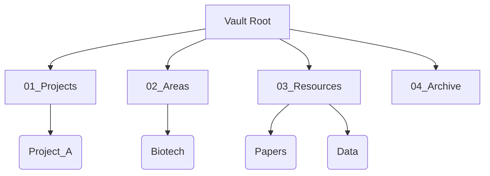
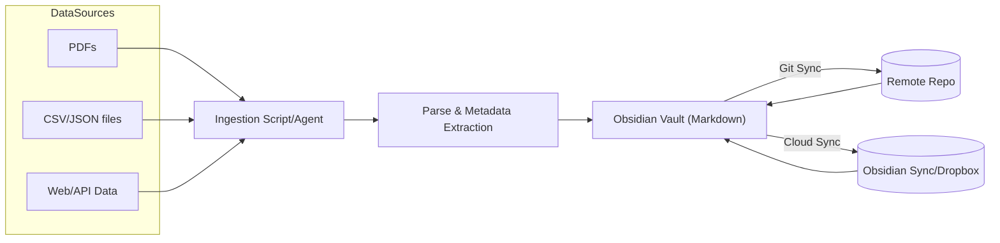
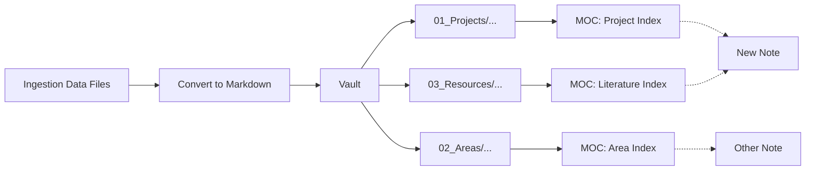

# Executive Summary  
To build a continuously‑updated research “second brain”, we propose an automated pipeline that **ingests** new data (papers, CSVs, JSON, web content) into an Obsidian vault, enriching it with metadata and linking. We use **OpenCode** (an AI coding agent) or custom scripts to fetch and parse inputs, then generate Markdown notes with YAML frontmatter, storing them in a well-structured vault.  Automation (e.g. cron jobs, webhooks or CLI tools) triggers ingestion and conversion (for example, using `pdftotext`, Python or shell) whenever new research outputs arrive. Notes are named with a clear convention (e.g. `YYYYMMDD_Source_Title.md`【8†L252-L259】) and include a schema of fields (author, date, type, etc).  We employ Obsidian **plugins** like Dataview, Tasks, Tag Wrangler, and Daily/Periodic Notes for querying, task management, and chronological notes. The vault is version-controlled with Git and synced (Obsidian Sync or cloud storage)【17†L1-L9】【3†L185-L193】. The report details the **integration architecture**, data parsing methods, naming/YAML schema, tagging vs folder strategies, note templates (literature review, experiments, meetings), and a step-by-step implementation and monitoring plan. Included are sample folder trees, YAML schemas, filename patterns, and pseudocode for ingestion. Tables compare integration options and trade-offs; mermaid diagrams illustrate system and vault workflows.  

## Integration Architecture and Automation Pipelines  
**Overview:** The system ingests research outputs from various sources into the Obsidian vault. Components include: a *Data Ingestion* layer (scripts or agents to fetch or receive data), a *Processing* layer (parsing files, extracting metadata), and the *Obsidian Vault* (Markdown store with links). An AI agent like OpenCode can orchestrate steps (running shell tools, reading/writing files) or custom code can be written (Python/Node) for fine-grained control.  

**Data Ingestion:** Data sources may include: 
- **Files** (new PDFs downloaded or placed in a watched directory; CSV/JSON exports from experiments; scraped HTML).  
- **APIs/Webhooks** (e.g. a GitHub webhook triggers on new repo file, or a custom API supplies data).  
- **Web Content** (using OpenCode’s `webfetch` or `websearch` to gather info).  
Tools: schedule a cron job or use OS file watchers to detect new files. For instance, a daily cron could run a Python script that scans a `Downloads/` folder for new PDFs. Alternatively, an OpenCode agent could run continuously or on demand, using its `bash`, `grep`, and `webfetch` tools to retrieve and parse content【71†L246-L254】【71†L281-L290】.  

**Parsing & Metadata Extraction:** Once a file is ingested, convert and extract metadata: 
- **PDFs:** use `pdftotext` or PyMuPDF to extract text, then parse title/authors (first page or metadata).  
- **CSV/JSON:** use Python or Node (e.g. `pandas` or `csv/json` libs) to extract summaries (e.g. table headers, summary statistics).  
- **Web Pages:** use OpenCode’s `webfetch` or Python `requests` + BeautifulSoup to scrape text and metadata (title, date).  

Processing can be scripted. For example, a Python pseudo-code for PDF ingest:

```python
import subprocess, yaml
text = subprocess.run(["pdftotext", "input.pdf", "-"], capture_output=True, text=True).stdout
title = extract_title(text)             # custom function
authors = extract_authors(text)         # custom function
date = extract_date(text)
metadata = {"title": title, "authors": authors, "date": date, "type": "paper"}
content = yaml.safe_dump(metadata) + "\n---\n" + text
with open(f"Vault/Resources/{date}_{slugify(title)}.md", "w") as f:
    f.write(content)
```

This produces a Markdown note with YAML frontmatter (see YAML schema below). We recommend including fields like `title`, `authors`, `year`, `source`, `tags`, etc. Fields should be URI-safe and lowercase (e.g. `authors`, `year`)【73†L108-L117】.  

**Automation:**  Automate the above steps by scheduling scripts or using event triggers: 
- **Cron/GitHub Actions:** e.g., a nightly job runs a Python/Node script that ingests any new files, converts them, and commits to the vault repo.  
- **File Watchers:** On systems like Linux/Mac, `inotify` (via a service like `entr` or `fswatch`) can trigger conversion as soon as a file appears.  
- **Webhooks/HTTP APIs:** Use a simple web service (Flask/FastAPI) that receives a POST (e.g. from a lab instrument or code pipeline) and runs ingestion.  
- **OpenCode Agent:**  Alternatively, an OpenCode agent could be configured with tools (`bash`, `webfetch`, `grep`) to pull data (e.g. from websites or file system) on command or schedule. For example, a cron job could call `opencode -c ingest-skill` where a custom skill automates the steps.  

**Monitoring & Alerting:** Log the ingestion pipeline actions to a file or stdout/stderr. Failures (parsing errors, missing fields) should be caught and emailed or sent to Slack. For instance, the script can catch exceptions and call a monitoring webhook (like PagerDuty or an email API). Tools like Node’s `@actions/core` (if using GitHub Actions) can flag jobs as failed. Logging each file’s status (success or error) is critical.  

### Integration Options – Comparative Table  

| Method                       | Description                             | Pros                                                  | Cons                                           |
|------------------------------|-----------------------------------------|-------------------------------------------------------|------------------------------------------------|
| **Custom Script/Cron**       | Write Python/Node script run on schedule| Fully customizable; no dependencies on other services | Requires maintaining code and servers/schedules |
| **OpenCode Agent**           | Use OpenCode CLI or TUI with tools      | Conversational; leverages LLM for complex parsing; agent can chain commands【71†L246-L254】 | More overhead to configure; requires API keys for LLM providers【68†L100-L109】 |
| **GitHub Actions**           | CI workflow triggers on push or schedule| Built-in version control integration; no local server  | Needs repo on GitHub; learning YAML workflows  |
| **Zapier/IFTTT**             | Cloud automation (e.g. on Dropbox drop) | User-friendly; no coding                           | Limited for large data; can incur costs        |
| **Custom Service (FastAPI)** | Develop own REST API for ingestion     | Fully flexible; can push data via HTTP               | Requires hosting and security                   |

## File Formats, Naming and Folder Structure  
**Vault Layout:** We suggest a PARA-inspired hierarchy: e.g.  
```
Vault/
├─ 01_Projects/   (active research projects)
├─ 02_Areas/      (ongoing themes like “Machine Learning”, “Biology”)
├─ 03_Resources/  (literature notes, data sources)
├─ 04_Archive/    (completed projects/data)
├─ Daily_Notes/   (journal/logs)
└─ Templates/     
```
This uses numbered prefixes for sorting. Projects/Areas can have subfolders for each project or responsibility. Resources/ holds reference material (papers, datasets) that are static.



**Folder vs Flat Trade-offs:**  
- **Folders (Hierarchical):** Provide clear structure and cognitive anchors; easy for humans to navigate 【10†L275-L282】. Good for mutually exclusive categories (e.g. project-specific notes vs general areas).  
- **Flat (All-in-One with Tags):** Every note sits in one folder (e.g. root) but is richly tagged. This avoids depth but can be chaotic if not disciplined【10†L294-L302】.  
- **Hybrid:** We recommend hybrid: use folders for broad categories (above) and tags for context. For example, a paper note in `Resources/` may have tags `#paper`, `#machine-learning`. Remarkable’s guide suggests folders for broad categories and tags for contextual cross-references【10†L275-L282】【10†L294-L302】.

**Naming Conventions:** Use descriptive, machine-sortable names【8†L252-L259】. We suggest:  
```
YYYYMMDD_SourceKey_Info-snippet_vX.md
```  
Example: `20260315_arxiv_Transformers_for_Biology_v1.md`.  Include date or version to prevent duplicates; use hyphens or underscores (no spaces)【8†L290-L299】.  Keep titles under 60 characters if possible【8†L310-L319】. If including dates, use ISO `YYYY-MM-DD` or compact `YYYYMMDD` to sort chronologically【8†L252-L259】.  

**File Formats:** All notes in plaintext Markdown (`.md`). For data outputs (e.g. CSVs), either import as tables in markdown or attach as files in the vault (e.g. under `Resources/Data/`). Avoid proprietary formats inside vault; use markdown for notes and add any data files in a subfolder, linking them with Obsidian’s `![[path]]` syntax if needed.

**Versioning & Backup:** Treat the vault as a Git repo (see Obsidian Help)【17†L1-L9】. Commit after major ingest batches. Enable Obsidian Sync or a cloud folder sync (Dropbox, OneDrive) for real-time backup【17†L1-L9】【3†L185-L193】. Store a `.gitignore` ignoring transient files. Regularly push to remote (GitHub/Bitbucket) for offsite backup. Box’s best practice: “The most fundamental file management tip: back up”【3†L185-L193】. 

## YAML Frontmatter Schema and Tagging  
**Frontmatter Schema:** Each Markdown note should start with a YAML block containing structured metadata. Example schema fields:  
```yaml
---
title: "Sample Paper Title"
authors: ["Doe, John", "Smith, Jane"]
year: 2025
source: "arXiv"
type: "paper"         # or 'experiment', 'meeting', etc.
tags: ["#neuroscience", "#review"]
date: 2026-03-17      # creation or publication date
project: "DeepBrain"
status: "completed"   # or 'pending'
---
```
Use keys like `title`, `authors`, `year`, `tags`, following Obsidian’s YAML conventions【73†L108-L117】. Tags inside YAML should be in an array format without the `#` (or with, depending on Dataview preferences) because Dataview will index them【73†L108-L117】. Include a `type` or `format` field to differentiate note kinds.  

**Tagging and MOCs:** In addition to YAML tags, consider using Map-of-Content (MOC) pages. For example, have an “Literature MOC” that links all notes with `type: paper`, and an “Experiments MOC” for lab notebooks. Tags allow multi-dimensional search (e.g. `#urgent`, `#projectX`) while MOCs act as manual indexes. Dataview queries can list notes by tag or folder【73†L108-L117】. For tasks, use status tags or the Tasks plugin to filter.  

### Folder vs Tag Table  

| Strategy    | Description                                  | Pros                                         | Cons                                                  |
|-------------|----------------------------------------------|----------------------------------------------|-------------------------------------------------------|
| **Folders** | Hierarchical organization by project/theme【10†L275-L282】 | Clear structure; easy context (cognitive anchor) | Hard to share note across folders; deeper navigation  |
| **Tags**    | Flat organization, categorize notes by keywords【10†L294-L302】 | Flexible, note can have many contexts; great for transversal queries | Can become chaotic if too many/overlapping tags       |
| **Hybrid**  | Use folders for big buckets (Projects, Areas) and tags for attributes【10†L275-L282】 | Combines clarity of folders with flexibility of tags | Requires consistent discipline on both fronts         |

## Obsidian Use: Templates, MOCs, Plugins, and Workflows  
**Note Templates:** Define templates for common note types:  
- **Literature Note:** includes fields for title, authors, summary, key points, BibTeX citation, and `tags::` inline fields or YAML for keywords.  
- **Experiment/Lab Note:** fields for experiment date, materials, results (with embed of data CSV/chart), analysis, and tags.  
- **Meeting Note:** includes `date::`, `attendees::`, `agenda::`, `notes::`, `action-items::` (the Tasks plugin can manage checkboxes).  

Example meeting template (in `Templates/`):

```md
---
title: "{{title}}"
date: {{date}}
attendees: []
tags: [meeting, {{project}}]
---

# Meeting: {{title}}
**Date:** {{date:YYYY-MM-DD}}  
**Attendees:** {{attendees}}

## Agenda
- 

## Notes
- 

## Action Items
- [ ] 
```

These ensure consistent structure. The Obsidian **Templates** core plugin can auto-insert them when creating a new note type.  

**Daily/Periodic Notes:** Use the **Daily Notes** plugin for daily journaling of tasks or discoveries【76†L1-L4】. Configure it to store in `Daily_Notes/`. Periodic Notes plugin adds weekly/monthly notes (helpful for weekly reviews)【78†L294-L303】. Use these to track progress, meeting logs, or checklists.  

**Map of Content (MOC) Notes:** Create MOC pages as hubs (e.g. “Project X Overview” listing related notes, or an “Inbox” note). Whenever a new note is created, link it to the relevant MOC. This complements search and tags. For instance, after ingesting a new paper, edit your “Literature MOC” to include `- [[20260315_...]] – Paper Title`. This manual linking is advised by knowledge-management experts【47†L95-L103】【47†L148-L160】.  

**Backlinks & Graph:** Enable the graph view for a visual map of note connections. This helps spot isolated notes. Use Obsidian’s automatic backlinks pane to review where a note is referenced (e.g. see all meetings that discussed a topic).  

**Plugins:** Recommended Obsidian plugins and trade-offs:
- **Dataview**【73†L60-L68】 – Create dynamic queries on metadata (e.g. list all papers tagged `#2026`). Powerful but requires learning its query language.  
- **Tasks** – Advanced task queries (e.g. all `#urgent` tasks across notes) and recurring tasks management. Excellent for project management; adds `tasks:` frontmatter and checkbox querying. Slight overhead to learn its syntax.  
- **Tag Wrangler** – Bulk rename/merge tags【21†L83-L92】. Simplifies tag management; use for periodic cleanup.  
- **Calendar + Periodic Notes** – For daily/weekly notes context【21†L59-L68】【78†L294-L303】. Makes navigation easy.  
- **Templater** – More powerful templating (Javascript) than core Templates; useful for complex note creation (e.g. embedding citations). Slight setup effort.  
- **Search Enhancers (e.g. *Cursor on file path*)** – For cross-platform metadata or automations (optional).  
Each plugin trades simplicity for power. Start with core plugins and only add heavy ones (Dataview, Tasks) once needed.  

### Comparing Workflow Options  

| Workflow Tool       | Purpose                               | Pros                                        | Cons                                            |
|---------------------|---------------------------------------|---------------------------------------------|-------------------------------------------------|
| **OpenCode Agent**  | LLM-driven terminal automation        | Can chain commands (bash, webfetch, etc.)【71†L246-L254】; adaptable via LLM reasoning   | Requires LLM API (cost); complex to configure   |
| **Python/Node Scripts** | Custom ETL pipelines                | Full control; easily integrate libraries    | Needs manual coding; no conversational interface |
| **Obsidian CLI (Community)** | Some community tools (e.g. obsidian.md CLI plugin) | Potential for scripted vault operations | Not official; limited features                 |
| **Zapier/IFTTT**    | Low-code automation                   | Easy triggers (e.g. on new email or Dropbox) | Not ideal for large data; costs for usage       |

## Implementation Roadmap (Step-by-Step)  
1. **Plan Vault Structure & Naming:** Sketch your PARA folders and conventions. Decide on metadata schema (see above).  
2. **Create Vault & Enable Sync:** Initialize the Obsidian vault (local folder). Enable **Obsidian Sync** or place vault in a cloud-synced folder (e.g. Dropbox). Initialize a Git repo for version control. Make an initial commit.  
3. **Set Up Core Plugins:** In Obsidian Settings, enable *Daily Notes*, *Templates*, *Backlinks*, *Graph View*, and *Search*. Install and enable Dataview, Tasks, Tag Wrangler, Calendar, Periodic Notes. Configure Calendar/Periodic to your preferred folders and formats.  
4. **Build Templates & MOCs:** Create template notes in `Templates/`. Create key MOCs (e.g. “Literature Inbox”, “Project Index”) in appropriate folders. Set up a template for new literature notes including metadata fields.  
5. **Develop Ingestion Scripts:** Write scripts (Python/Node) or OpenCode agent skill to handle each data type: PDFs → Markdown, CSV/JSON → summary tables, web pages → text. Include metadata extraction. Test these scripts manually.  
6. **Automate Execution:** Use cron (Linux/macOS) or Task Scheduler (Windows) to run the ingest script on a schedule (e.g., nightly). Alternatively, set up a GitHub Action that runs on a schedule or when files are added to a source repository. Ensure the script writes notes directly into the vault directory.  
7. **Monitoring:** Integrate logging in the scripts (log file or email notifications on error). For advanced ops, send metrics to a monitoring tool (e.g. Prometheus, or simply Slack).  
8. **Testing & Dry Runs:** Perform test ingests, verify that notes appear correctly in Obsidian (with links, tags). Check Dataview queries to ensure metadata was indexed.  
9. **Migration (if needed):** If migrating existing notes (from other systems), convert them to markdown and move into the vault. Use Obsidian’s Evernote importer for ENEX files【51†L1-L9】, or Pandoc/Notion APIs for other sources. Re-tag or re-folder as per new system.  
10. **Train Usage:** Document the workflow (e.g. README.md in vault) and train team members on naming, tagging, and how/when ingestion runs. Set norms: e.g. after adding a new reference, update the “Literature Inbox” MOC and tag with `#projectX`.  

## Maintenance and Monitoring  
- **Daily:** Check daily note for any ingestion errors flagged. Use Tasks plugin to track any pending ingestion tasks.  
- **Weekly:** Review new notes and metadata. Clean up tags (Tag Wrangler: merge similar tags). Archive completed project folders to `Archive/`.  
- **Monthly:** Update Templates or MOCs based on feedback. Pull latest Obsidian updates and plugin updates. Ensure Git pushes succeeded and sync is working (watch out for sync conflicts).  
- **Incident Handling:** If ingestion fails (e.g. script crashes), ensure alerts (email/Slack) trigger. Keep a log (`ingestion.log`). For example, in Python: 
   ```python
   try:
       ingest_pdf(file)
   except Exception as e:
       send_email("Ingestion failed", str(e))
       raise
   ```  
- **Backups:** Verify the Git remote has all commits. Periodically export the vault or take a full backup (zip) for disaster recovery.  
- **Security/Privacy:** Since research data may be sensitive, restrict who can access the vault. If using cloud sync, ensure encryption (Obsidian Sync is encrypted by default). For any webhooks/APIs used, secure endpoints (HTTPS, API keys). If using OpenCode or LLMs, be cautious: do **not** send proprietary data to third-party APIs unless permitted. OpenCode’s docs emphasize it “does not store any of your code or context data”【67†L77-L82】, which is privacy-friendly.  

## Examples and Templates  

**Sample Folder Tree:**  
```
Vault/
├─ 01_Projects/
│   ├─ BrainStudy/
│   │   ├─ 2026-03-15_BrainMapping_ConferenceTalk.md
│   │   └─ Meeting_Notes_March2026.md
│   └─ GenomeSeq/
├─ 02_Areas/
│   ├─ Neuroscience/
│   └─ Genomics/
├─ 03_Resources/
│   ├─ Papers/
│   │   └─ 2026-01-20_NeuralNetworksInNeuroscience.md
│   ├─ Data/
│   │   └─ experiment_results.csv
│   └─ Tools/
│       └─ data_processing.py
├─ 04_Archive/
│   └─ Old_Project/
├─ Daily_Notes/
└─ Templates/
    ├─ LiteratureTemplate.md
    ├─ ExperimentTemplate.md
    └─ MeetingTemplate.md
```

**Filename Patterns:**  
- Papers: `YYYYMMDD_Source_Title.md` (e.g. `20260310_arxiv_DeepLearningBrain.md`)  
- Data: `YYYYMMDD_Project_DataDescription.csv`  
- Meeting: `YYYYMMDD_Project_MeetingName.md`  

**YAML Example (Literature Note):**  
```yaml
---
title: "Reinforcement Learning in Neuroscience"
authors: ["Doe, Jane", "Lee, Mark"]
year: 2023
source: "Nature"
type: "paper"
tags: [neuroscience, RL, review]
project: "BrainStudy"
---

Summary of key insights...
```

**YAML Example (Experiment Note):**  
```yaml
---
title: "Lab Experiment 5: Neuron Firing Rates"
date: 2026-03-15
type: "experiment"
tags: [neuroscience, data]
project: "BrainStudy"
device: "EEG-3000"
params:
  - electrode: "F3"
  - stimulus: "light flash"
---
Results and observations...
```

**Note Template (Experiment):**  
````md
---
title: "{{title}}"
date: {{date}}
type: experiment
project: {{project}}
tags: [{{tags}}]
---
# Experiment: {{title}}

**Date:** {{date:YYYY-MM-DD}}  
**Project:** {{project}}  
**Tags:** {{tags}}

## Setup
- 

## Results
- 

## Analysis
- 

## Data  
Embedded data or charts:
```
```dataview
TABLE file.link AS "File", summary
FROM "03_Resources/Data"
WHERE contains(file.name, this.file.name) 
```
```  
````

**Automation Script Snippet (Node.js Pseudocode):**  
```js
const fs = require('fs');
const { execSync } = require('child_process');
const pdf2md = (pdfPath) => {
  let text = execSync(`pdftotext -layout ${pdfPath} -`).toString();
  // extract metadata (simplified)
  let [titleLine, ...body] = text.split('\n');
  let title = titleLine.trim();
  return { title, content: body.join('\n') };
};

let files = fs.readdirSync('IncomingPapers');
files.forEach(file => {
  if (file.endsWith('.pdf')) {
    let { title, content } = pdf2md(`IncomingPapers/${file}`);
    let date = new Date().toISOString().slice(0,10).replace(/-/g,'');
    let slug = title.toLowerCase().replace(/[^\w]+/g,'-');
    let filename = `${date}_paper_${slug}.md`;
    let yaml = `---
title: "${title}"
date: ${new Date().getFullYear()}
source: "ArXiv"
type: "paper"
tags: []
---`;
    fs.writeFileSync(`Vault/03_Resources/Papers/${filename}`, `${yaml}\n\n${content}`);
  }
});
```

## Security, Privacy, and Permissions  
Use secure methods for any network interactions (HTTPS). If using OpenCode with online LLM providers, ensure no proprietary data leaks; use local models (OpenCode supports local LLMs) if needed. Obsidian vault access should be restricted (use OS file permissions). For cloud sync, rely on end-to-end encryption (Obsidian Sync is encrypted by default). Monitor dependency licenses (OpenCode is open source, check its license compatibility).  

## Mermaid Diagrams  

**System Architecture:** A simplified data flow is shown below. Sensors, lab systems, or researchers produce new data/files, which are picked up by the Ingestion Pipeline (scripts or OpenCode). The pipeline extracts content and metadata, then outputs Markdown notes into the Obsidian Vault. The vault is synced via Git/Obsidian Sync, and tools like Dataview and Task queries run on the updated notes.



**Vault Workflow:** Internally, the vault is organized into Projects, Areas, Resources, etc. New notes (literature, data, meetings) link into this structure. The diagram below illustrates note creation and linking (MOCs, tags):



## Sources and Best Practices  
This strategy follows Obsidian’s official guidance on vault management (a vault is just a folder you can sync with cloud or Git【17†L1-L9】) and file management best practices (use clear folder structure, naming conventions, and backups【3†L185-L193】【8†L252-L259】). The Dataview and Tasks plugin documentation inform our metadata and task queries【73†L60-L68】【22†L158-L167】. Recommendations for hybrid folder-tag organization and MOCs come from knowledge-management literature【10†L275-L282】【47†L148-L160】. Taken together, this results in a robust, automated second brain for research.