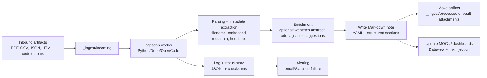
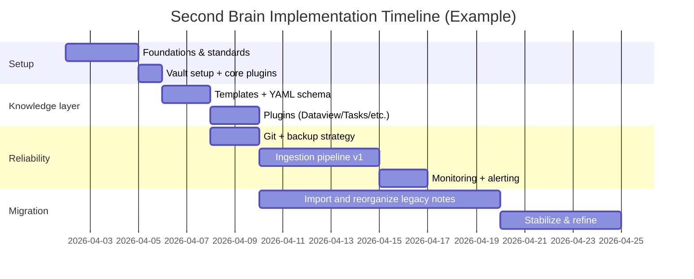

# A Hyper‑Organized Computer File System and Continuously Updated Obsidian Second Brain

## Executive Summary  
This report proposes a single, cohesive system that treats your OS file system as the “artifact layer” (documents, PDFs, datasets, code, exports) and an Obsidian vault as the “knowledge layer” (structured notes, metadata, links, MOCs, tasks). Obsidian is well-suited for this because it stores notes as local Markdown plain text inside a vault folder, can be managed by normal file managers/editors, and automatically refreshes when files change externally—making automated ingestion feasible. citeturn8view2  
The system is designed to be hyper‑organized without becoming brittle: stable folder standards + strict naming conventions + YAML/Properties schema + consistent tags + MOCs for navigation, with automation handling repetitive work (imports, metadata extraction, note creation). File naming is grounded in research-data-management guidance (meaningful names, ISO dates, avoid special characters/spaces, include versioning), which also improves searching and collaboration. citeturn8view1turn13view1  
A continuously-updated “second brain” is achieved via an ingestion pipeline (watch folders + scheduled jobs + optional webhooks) that parses incoming artifacts, extracts metadata, and writes new/updated Markdown notes into the vault. If you use entity["organization","OpenCode","opencode.ai coding agent"] or similar agents, you can run ingestion steps programmatically via the CLI and keep stringent permissions so agent actions require approval or are blocked by default. citeturn8view4turn9view1  
Backups and versioning are treated as first-class: Git for history/rollback, plus a 3‑2‑1 backup strategy for resilience (3 copies, 2 media types, 1 offsite). citeturn13view3turn13view2 Obsidian Sync is optional but valuable for multi-device use; its end‑to‑end encryption is strong, but you must manage the encryption password carefully because losing it can permanently lock remote vault data. citeturn8view3  

**Deliverables included here:** a standards “playbook” (folders, naming, YAML), plugin recommendations with trade-offs, mermaid diagrams, automation scripts/pseudocode, a migration checklist (Evernote/OneNote/Notion/flat files), monitoring/alerting plan, security/privacy checklist, and a step-by-step roadmap with effort estimates.

## Assumptions and Design Principles  
Because several details are unspecified, this system is built on explicit assumptions so you can swap components without breaking the overall architecture.

**Assumptions (you can change later):**
- OS/platform is unspecified; therefore, naming avoids cross-platform pitfalls and uses portable formats (Markdown, CSV, JSON, PDF). citeturn8view1turn8view0  
- Single user by default; collaboration conventions are included but optional. citeturn8view1  
- “OpenCode” refers either to opencode.ai’s tooling or a comparable local agent/scripts; where OpenCode-specific features are used, alternatives (Python/Node + cron/GitHub Actions) are also provided. citeturn8view4turn9view0  
- Authentication methods are unspecified; the plan assumes API tokens and secrets are stored in a password manager/OS keychain and injected via environment variables, not stored in the vault or Git history. citeturn8view3turn9view1  

**Design principles (why this works long-term):**
- **Reduce cognitive load:** your system should make the “next correct action” obvious (where to save, how to name, what metadata to add). File naming conventions and predictable folders make items discoverable. citeturn8view1turn13view1  
- **Optimize for retrieval, not capture:** research shows “practice testing” (retrieval practice) and “distributed practice” (spacing) are among the highest-utility learning techniques; your system should enable frequent, lightweight review and questioning instead of passive re-reading. citeturn13view4turn14view0  
- **Separate artifacts from meaning:** raw files live in the OS file system; Obsidian notes interpret and connect them. Because Obsidian auto-refreshes external changes, automation can safely write notes while you focus on thinking. citeturn8view2  
- **Make it reversible:** Git provides history and rollback for notes, configs, and many text artifacts. Version control is explicitly designed to record changes so you can recall prior versions. citeturn13view3  

## Computer File Standards  
This section defines the “hyper-organized” computer file layer. The goal is simple: every artifact has exactly one canonical home, a predictable filename, and a version/back-up story.

**Top-level folder standard (portable and PARA-like):**
```text
/Knowledge/
  00_INBOX/                 # temporary drop zone, processed daily/weekly
  01_PROJECTS/              # time-bounded deliverables
  02_AREAS/                 # ongoing responsibilities (health, finances, learning)
  03_RESOURCES/             # reference material (papers, manuals, datasets)
  04_ARCHIVE/               # completed/obsolete, read-only
  90_TEMPLATES/             # reusable project skeletons
  99_SYSTEM/                # naming rules, READMEs, automation configs, logs
```
This mirrors research-data-management guidance: keep names informative and independent of location, and use structure to support classification and searching. citeturn8view1  

**Project folder skeleton (copy this per project):**
```text
/Knowledge/01_PROJECTS/2026-04_ProjectSlug/
  00_admin/                 # contracts, approvals, project brief
  01_notes/                 # meeting notes exported/archived (not your Obsidian KB)
  02_sources/               # PDFs, references, raw inputs
  03_data_raw/              # immutable raw data
  04_data_processed/        # derived data
  05_code/                  # scripts, notebooks
  06_outputs/               # figures, drafts, exports
  07_release/               # final deliverables (read-only)
  README.md                 # “how to navigate this project”
```
If you later automate ingestion into Obsidian, you’ll mostly watch `02_sources/`, `03_data_raw/`, and `06_outputs/`.

### Filename Convention and Versioning  
Use a filename format that sorts chronologically, is readable, and survives OS constraints.

**Recommended filename pattern (canonical):**  
`YYYY-MM-DD__context__descriptor__vNN.ext`

This aligns with best-practice guidance: meaningful but brief names, ISO dates, avoid special characters/spaces, use hyphens/underscores, and include versioning when needed. citeturn8view1turn13view1  

**Examples (good):**
- `2026-04-02__brainstudy__meeting-notes__v01.md`  
- `2026-03-28__genomics__sample-sheet__v03.csv`  
- `2026-04-01__projectslug__draft-proposal__v02.docx`  

**Examples (bad) and why:**
- `final.docx`, `final2.docx`, `definitive_final.docx` → discouraged; versions should be explicit and sortable. citeturn4search13  
- `Focus group consumers 12 Feb?.doc` → special characters and ambiguous content. citeturn8view1  

**Versioning rule (simple, durable):**
- Use `v01`, `v02` for major revisions; optionally `v01_01` for minor edits. This matches common RDM guidance and avoids “final” naming traps. citeturn4search13  
- If you use Git for a directory, prefer *Git commits* over filename versions for text/code files; keep filename versioning for binaries (slides, PDFs, docx) or external deliverables.

### Cross-Platform Constraints  
Cross-platform friction often comes from filename edge cases and path behaviors, so your standards should avoid them from day one.

**Rules to prevent OS sync issues:**
- Avoid spaces and special characters in filenames; use `-` or `_` separators. citeturn8view1turn13view1  
- Do not end file/folder names with a space or period; Windows UI can behave poorly even if the underlying filesystem supports it. citeturn8view0  
- Keep paths reasonably short to reduce “path length” issues when syncing or nesting deeply (especially if you later use multiple sync tools). citeturn8view0  

### Search and Discovery Strategy  
A hyper-organized system still needs fast retrieval, and retrieval depends heavily on consistent names and metadata.

**OS-level discovery:**
- Ensure every important artifact is discoverable by filename alone (date + context + descriptor). This is recommended because file names act as primary identifiers and support sorting/searching. citeturn8view1  
- Standardize “context” tokens (project slug, course code, client). If you change the slug, bulk-rename.

**Obsidian-level discovery:**
- Treat Obsidian as the index: every major artifact should have a note that links to it and summarizes what it is for.

### Backup and Recovery Standard  
Backups are not optional in a continuously updated system.

**Baseline: 3‑2‑1 backup strategy**
- Keep **three copies** of your data, on **two different media**, with **one offsite**. citeturn13view2  
- A practical mapping: (1) local working copy, (2) external drive snapshot, (3) offsite cloud backup.

**Version control for knowledge assets**
- Version control “records changes over time so you can recall specific versions later,” which is ideal for notes, configs, scripts, and many project docs. citeturn13view3  
- Use Git for: Obsidian vault (excluding volatile caches), project READMEs, scripts, data dictionaries, and any text-based research assets.

## Obsidian Vault Standards  
This section defines the “second brain” layer: how notes are structured, how metadata works, and how plugins support an optimized workflow.

### Vault Fundamentals and Boundaries  
Obsidian stores notes as Markdown plain text inside a vault folder, and it refreshes when files change externally—this is the key enabler for automation pipelines that write notes into the vault. citeturn8view2  
Because internal links are local to a vault, Obsidian recommends avoiding “vaults within vaults” and also warns against creating a vault in Obsidian’s system folder due to corruption/data-loss risk. citeturn8view2  
Practically, this means: keep one vault for your second brain, and link out to external project artifacts rather than embedding everything as notes.

### Recommended Vault Folder Tree  
```text
SecondBrainVault/
  00_HOME/
    Home.md                 # start page, dashboards, “how to use this vault”
    MOC_Index.md
  01_PROJECTS/
    ProjectSlug/
      ProjectSlug_MOC.md
      ProjectSlug_ResearchLog.md
  02_AREAS/
    AreaName/
      Area_MOC.md
  03_RESOURCES/
    Literature/
    People/
    Concepts/
    Tools/
  04_LOGS/
    Daily/
    Weekly/
    Monthly/
  05_OUTPUTS/
    Writing/
    Figures/
  90_TEMPLATES/
  99_SYSTEM/
    Standards_Naming.md
    Standards_YAML.md
    Tag_Taxonomy.md
    Ingestion_Playbook.md
  _attachments/
  _ingest/
    incoming/               # watched drop folder (optional)
    processed/
    failed/
```

This structure emphasizes entry points (“Home”, MOCs) and creates predictable places for each note type.

### YAML / Properties Schema Standard  
Obsidian properties are stored in YAML format at the top of the file; each property name must be unique (e.g., only one `tags` property). citeturn10view3  
Tags in YAML should be formatted as a list, and nested tags can be represented with slashes (e.g., `inbox/to-read`). citeturn10view4  

**Core schema (use this everywhere):**
```yaml
---
id: "2026-04-02T193000Z_projectslug_meeting_001"  # stable ID for automation
type: meeting                                    # meeting | literature | experiment | concept | project | daily | weekly
title: "ProjectSlug — Weekly Sync"
created: 2026-04-02
updated: 2026-04-02
tags:
  - project/projectslug
  - type/meeting
  - status/processed
links:
  - "[[ProjectSlug_MOC]]"
source:
  kind: "zoom"                                   # or email, pdf, web, repo, dataset
  uri: ""
---
```

**Type-specific extensions (add only what you need):**
- Literature notes: `authors`, `year`, `doi`, `venue`, `citation_key`
- Experiments: `hypothesis`, `dataset_uri`, `code_repo`, `metrics`
- Meetings: `attendees`, `decisions`, `actions`

### Tagging and MOC Strategy  
Tags are for slicing, MOCs are for navigation.

**Recommended tag taxonomy (nested tags):**
- `type/*` → `type/literature`, `type/experiment`, `type/meeting`  
- `status/*` → `status/inbox`, `status/processing`, `status/evergreen`, `status/archived`  
- `project/*` → `project/projectslug`  
- `topic/*` → `topic/neuroscience`, `topic/ml`, `topic/security`  

Nested tags are first-class: tag searches like `tag:inbox` can match nested tags such as `#inbox/to-read`. citeturn10view4  

**MOCs (Maps of Content) standard:**
- One MOC per Project (`ProjectSlug_MOC.md`)  
- One MOC per Area (`Area_MOC.md`)  
- A central index (`MOC_Index.md`) linking all MOCs  
- Optional: “Literature MOC” pages generated/maintained via Dataview queries

### Templates You Should Adopt  
Obsidian Templates is a core plugin that inserts pre-defined snippets and supports template variables like `{{date}}` and `{{title}}`. citeturn11view2  
Daily Notes is a core plugin that creates/opens a note named by today’s date and can use a template. citeturn11view3  

**Literature note template (90_TEMPLATES/Literature.md):**
```md
---
id: ""
type: literature
title: "{{title}}"
created: "{{date}}"
tags:
  - type/literature
  - status/inbox
authors: []
year: ""
doi: ""
venue: ""
citation_key: ""
source_uri: ""
---

# {{title}}

## TL;DR
- 

## Key contributions
- 

## Methods / data
- 

## Notes in my own words
- 

## Questions to test myself
- Q1:
- Q2:

## Links
- Related concepts: 
- Related projects:
```

**Experiment note template (90_TEMPLATES/Experiment.md):**
```md
---
id: ""
type: experiment
title: "{{title}}"
created: "{{date}}"
tags:
  - type/experiment
  - status/inbox
project: ""
dataset_uri: ""
code_repo: ""
---

# {{title}}

## Hypothesis
- 

## Setup
- Inputs:
- Parameters:
- Environment:

## Results (raw)
- Link to outputs:
- Link to figures:

## Interpretation
- 

## Next experiments
- [ ] 
```

**Meeting note template (90_TEMPLATES/Meeting.md):**
```md
---
id: ""
type: meeting
title: "{{title}}"
created: "{{date}}"
tags:
  - type/meeting
  - status/inbox
attendees: []
project: ""
---

# {{title}}

## Agenda
- 

## Notes
- 

## Decisions
- 

## Action items
- [ ] 
```

**Daily note template (04_LOGS/Daily template):**  
Daily Notes defaults to a `YYYY-MM-DD` filename and can be configured to create subfolders based on date format if you want. citeturn11view3  
```md
---
type: daily
date: "{{date}}"
tags:
  - type/daily
---

# {{date:YYYY-MM-DD}}

## Top priorities
- [ ] 

## Research log
- 

## Retrieval practice (5 minutes)
- Q:
- A:

## Links created today
- 
```

### Built-in Navigation Features You Should Use  
Backlinks show all notes that link to the current note, reinforcing “networked” knowledge. citeturn7search1  
Graph view visualizes relationships between notes as nodes and links, helping you find clusters or orphan notes. citeturn11view1  
Obsidian Search supports operators (e.g., `tag:`, `file:`, `path:`) and Boolean logic, which becomes extremely powerful once you standardize tags and filenames. citeturn11view0  

### Plugin Recommendations and Trade-offs  
The following plugin/service recommendations are grounded in their official docs and established workflows.

Dataview is a live index and query engine over your vault’s metadata and supports YAML frontmatter and inline fields. citeturn9view3  
Tasks tracks tasks across your entire vault, supports due dates and recurring tasks, and lets you query and update tasks from views. citeturn9view4  
Calendar provides a calendar view for navigating daily notes and can use your daily note settings. citeturn12view3  
Periodic Notes expands daily notes to weekly and monthly notes and integrates with Calendar (week numbers). citeturn12view2  
Templater is a more powerful templating system that can execute JavaScript within templates. citeturn12view4  
Obsidian Sync provides end-to-end encryption, but password loss can permanently lock the remote vault data. citeturn8view3  

| Plugin / Service | What it’s best for | Key advantages | Key trade-offs | Setup effort |
|---|---|---|---|---|
| Dataview | Dashboards, lists of notes by metadata, “dynamic MOCs” | Always-up-to-date queries; uses YAML/inline fields citeturn9view3 | Learning curve; queries require consistent schema | Medium |
| Tasks | Single task system across notes | Queryable tasks; recurring tasks; updates source files citeturn9view4 | Requires conventions (task tags, global filter) | Medium |
| Tag Wrangler | Cleaning and refactoring tags | Practical for renaming/organizing tags at scale (maintenance) citeturn1search2 | Mostly a maintenance tool, not daily workflow | Low |
| Calendar | Daily note navigation | Fast timeline navigation; respects daily note settings citeturn12view3 | Adds UI surface area; limited beyond daily/weekly | Low |
| Periodic Notes | Weekly/monthly planning & review | Adds weekly/monthly notes and integrates with Calendar citeturn12view2 | Another set of settings and templates to manage | Medium |
| Templater | High automation in templates | Variables + functions + JavaScript execution citeturn12view4 | Complexity; “too much power” can create brittle templates | Medium–High |
| Obsidian Sync | Multi-device sync with strong privacy | End-to-end encryption; verification guidance exists citeturn8view3turn0search17 | Password loss risk; local vault not encrypted citeturn8view3 | Low |

## Automation and Continuous Ingestion Architecture  
A continuously updated second brain is achieved by treating note creation and metadata enrichment as a pipeline. The pipeline can be implemented with scripts, agents, or both.

### Architecture Overview  
Obsidian’s ability to refresh external changes means your ingestion pipeline can write Markdown files directly into the vault, and they appear immediately. citeturn8view2  
OpenCode can be used as an orchestrator because it supports CLI commands (including programmatic usage) and configurable agents. citeturn8view4turn12view1  
OpenCode tools include `websearch` and `webfetch` (with `websearch` using Exa AI and requiring no API key) which can help enrich metadata or retrieve abstracts when you ingest papers. citeturn9view0  



### Automation Pipeline Options  
OpenCode’s CLI “accepts commands” so it can run tasks programmatically, and it also supports GitHub integration where commenting `/opencode` triggers work in GitHub Actions runners. citeturn8view4turn12view0  
If OpenCode isn’t available in your environment, the same workflow can be implemented with cron + Python/Node, or GitHub Actions schedules.

| Option | Best for | Pros | Cons | Operational risk |
|---|---|---|---|---|
| OpenCode CLI (local) | Flexible local automation | Programmatic CLI + agents; tool ecosystem citeturn8view4turn12view1 | Requires model/provider config; agent governance needed | Medium |
| OpenCode GitHub integration | Automation on repos & issues | Runs in GitHub runners; triggered by comments/events citeturn12view0 | Needs GitHub setup and secrets; oriented to repos | Medium |
| Cron + Python/Node scripts | “Always on” ingestion | Simple and transparent; easy logging/testing | You own reliability + upgrades | Low–Medium |
| GitHub Actions scheduled jobs | Cross-device consistency | Reproducible pipeline, runs on schedule | Needs repo + careful secret handling | Medium |
| Webhooks to local service | Real-time ingestion | Immediate updates, event-driven | Hosting and security concerns | High |

### Permissions, Privacy, and Agent Governance  
OpenCode’s permission config can force approvals (`ask`) or block (`deny`) sensitive actions and can be set globally with tool overrides. citeturn9view1  
OpenCode supports project rules via an `AGENTS.md` file, and the `/init` command can generate/update it; committing `AGENTS.md` helps keep outcomes consistent across sessions. citeturn9view2  
For Obsidian Sync, end‑to‑end encryption prevents Obsidian from reading your data, but the encryption password is unrecoverable; treat it like a cryptographic key and store it in a password manager. citeturn8view3  

**Practical privacy standard (recommended):**
- Put **no secrets** in the vault: no API tokens, SSH private keys, or credentials; keep them in a password manager and inject via env vars.
- Segment sensitive content: if needed, use a separate vault for highly sensitive notes (and a separate Sync password).
- Restrict agent permissions: default `ask` for file writes and `deny` for destructive shell commands unless explicitly required. citeturn9view1  

### Monitoring and Alerting Plan  
Automated ingestion will fail—monitoring is what makes it dependable.

**Minimum viable monitoring (do this first):**
- Maintain `SecondBrainVault/_ingest/ingest.log` (append-only) and `ingest_state.jsonl` with per-file status.
- Use file hashing (e.g., SHA-256) to ensure idempotency: if the same PDF arrives twice, skip or update deterministically.
- Exit with non-zero code on failures so schedulers (cron/GitHub Actions) can detect and alert.

**Alerting strategy:**
- On failure: send an email or Slack webhook with filename + error + stack trace.
- On repeated failures: escalate (e.g., after 3 consecutive runs).
- On success: daily digest summary (optional).

### Concrete Automation Examples  
All examples below assume Obsidian is pointed at `SecondBrainVault/` and your ingest drop folder is `SecondBrainVault/_ingest/incoming/`.

**Example A: Python “watch folder” ingestion (runnable with minimal edits)**  
This uses a polling loop (no extra dependencies). It converts PDFs via `pdftotext` if installed, extracts a crude title, writes a note, and moves files.

```python
#!/usr/bin/env python3
import os, time, json, hashlib, shutil, subprocess
from datetime import datetime, timezone

VAULT = os.path.expanduser("~/SecondBrainVault")
INCOMING = os.path.join(VAULT, "_ingest", "incoming")
PROCESSED = os.path.join(VAULT, "_ingest", "processed")
FAILED = os.path.join(VAULT, "_ingest", "failed")
NOTES_OUT = os.path.join(VAULT, "03_RESOURCES", "Literature")
LOG = os.path.join(VAULT, "_ingest", "ingest.log")
STATE = os.path.join(VAULT, "_ingest", "ingest_state.jsonl")

def sha256(path: str) -> str:
    h = hashlib.sha256()
    with open(path, "rb") as f:
        for chunk in iter(lambda: f.read(1024 * 1024), b""):
            h.update(chunk)
    return h.hexdigest()

def slugify(s: str) -> str:
    keep = []
    for ch in s.lower():
        keep.append(ch if ch.isalnum() else "-")
    slug = "".join(keep)
    while "--" in slug:
        slug = slug.replace("--", "-")
    return slug.strip("-")[:80] or "untitled"

def now_iso_date() -> str:
    return datetime.now(timezone.utc).date().isoformat()

def log_line(msg: str) -> None:
    ts = datetime.now(timezone.utc).isoformat()
    with open(LOG, "a", encoding="utf-8") as f:
        f.write(f"{ts} {msg}\n")

def write_state(entry: dict) -> None:
    with open(STATE, "a", encoding="utf-8") as f:
        f.write(json.dumps(entry, ensure_ascii=False) + "\n")

def pdftotext(pdf_path: str) -> str:
    # Requires poppler utils installed: pdftotext input.pdf - (stdout)
    result = subprocess.run(["pdftotext", "-layout", pdf_path, "-"], capture_output=True, text=True)
    if result.returncode != 0:
        raise RuntimeError(result.stderr.strip() or "pdftotext failed")
    return result.stdout

def extract_title(text: str) -> str:
    # naive heuristic: first non-empty line
    for line in text.splitlines():
        line = line.strip()
        if len(line) >= 8:
            return line[:120]
    return "Untitled Ingest"

def mk_note(pdf_path: str) -> str:
    text = pdftotext(pdf_path)
    title = extract_title(text)
    date = now_iso_date()
    fid = sha256(pdf_path)[:12]
    filename = f"{date}__paper__{slugify(title)}__{fid}.md"

    yaml = f"""---
id: "{date}T000000Z_paper_{fid}"
type: literature
title: "{title.replace('"', '\\"')}"
created: {date}
tags:
  - type/literature
  - status/inbox
source_uri: ""
artifact_path: "{pdf_path.replace('\\', '/')}"
---

# {title}

## TL;DR
- 

## Notes (auto-extracted)
"""
    out_path = os.path.join(NOTES_OUT, filename)
    with open(out_path, "w", encoding="utf-8") as f:
        f.write(yaml)
        f.write("\n")
        f.write(text[:20000])  # cap for sanity; keep full text elsewhere if needed
    return out_path

def main():
    for p in [INCOMING, PROCESSED, FAILED, NOTES_OUT]:
        os.makedirs(p, exist_ok=True)

    log_line("ingest loop started")
    while True:
        for name in sorted(os.listdir(INCOMING)):
            if not name.lower().endswith(".pdf"):
                continue
            src = os.path.join(INCOMING, name)
            try:
                note_path = mk_note(src)
                dst = os.path.join(PROCESSED, name)
                shutil.move(src, dst)
                log_line(f"OK {name} -> {note_path}")
                write_state({"file": name, "status": "ok", "note": note_path, "ts": datetime.now(timezone.utc).isoformat()})
            except Exception as e:
                dst = os.path.join(FAILED, name)
                shutil.move(src, dst)
                log_line(f"FAIL {name} -> {e}")
                write_state({"file": name, "status": "fail", "error": str(e), "ts": datetime.now(timezone.utc).isoformat()})
        time.sleep(30)

if __name__ == "__main__":
    main()
```

This pattern works well because Obsidian will refresh the vault when the ingestion script writes new Markdown files. citeturn8view2  

**Example B: Node.js CSV/JSON summarizer to “data note”**  
This creates a note describing a dataset and links to the artifact. It’s intentionally conservative: it only inspects headers/keys.

```js
#!/usr/bin/env node
const fs = require("fs");
const path = require("path");

const VAULT = process.env.VAULT || path.join(process.env.HOME || ".", "SecondBrainVault");
const INCOMING = path.join(VAULT, "_ingest", "incoming");
const NOTES_OUT = path.join(VAULT, "03_RESOURCES", "Data");

function slugify(s) {
  return (s || "untitled").toLowerCase().replace(/[^a-z0-9]+/g, "-").replace(/-+/g, "-").replace(/^-|-$/g, "").slice(0, 80);
}

function isoDate() {
  return new Date().toISOString().slice(0, 10);
}

function summarizeJSON(fp) {
  const raw = fs.readFileSync(fp, "utf8");
  const obj = JSON.parse(raw);
  if (Array.isArray(obj)) return { kind: "array", length: obj.length, sampleKeys: obj[0] ? Object.keys(obj[0]).slice(0, 30) : [] };
  if (obj && typeof obj === "object") return { kind: "object", keys: Object.keys(obj).slice(0, 50) };
  return { kind: typeof obj };
}

function summarizeCSV(fp) {
  const raw = fs.readFileSync(fp, "utf8");
  const firstLine = raw.split(/\r?\n/).find(l => l.trim().length > 0) || "";
  const headers = firstLine.split(",").map(h => h.trim()).slice(0, 50);
  return { headers };
}

function writeNote({ title, artifactPath, summary }) {
  const date = isoDate();
  const fname = `${date}__data__${slugify(title)}.md`;
  const out = path.join(NOTES_OUT, fname);

  const yaml = [
    "---",
    `type: data`,
    `title: "${title.replace(/"/g, '\\"')}"`,
    `created: ${date}`,
    `tags:`,
    `  - type/data`,
    `  - status/inbox`,
    `artifact_path: "${artifactPath.replace(/\\/g, "/")}"`,
    "---",
    "",
    `# ${title}`,
    "",
    "## What is this?",
    "- ",
    "",
    "## Quick summary (auto)",
    "```json",
    JSON.stringify(summary, null, 2),
    "```",
    "",
    "## Next actions",
    "- [ ] Add description and provenance",
    "- [ ] Link to related project MOC",
  ].join("\n");

  fs.mkdirSync(NOTES_OUT, { recursive: true });
  fs.writeFileSync(out, yaml, "utf8");
  return out;
}

for (const name of fs.readdirSync(INCOMING)) {
  const fp = path.join(INCOMING, name);
  if (name.toLowerCase().endsWith(".json")) {
    const summary = summarizeJSON(fp);
    const note = writeNote({ title: name, artifactPath: fp, summary });
    console.log("OK", name, "->", note);
  }
  if (name.toLowerCase().endsWith(".csv")) {
    const summary = summarizeCSV(fp);
    const note = writeNote({ title: name, artifactPath: fp, summary });
    console.log("OK", name, "->", note);
  }
}
```

**Example C: OpenCode-based ingestion command pattern**  
OpenCode’s CLI can be invoked programmatically and supports agents and permissions. citeturn8view4turn9view1  
A practical pattern is to create a dedicated “ingest agent” with restricted permissions and instructions, and call it from cron.

- Create `SecondBrainVault/99_SYSTEM/AGENTS.md` (project rules) describing your YAML schema and file routing. OpenCode explicitly supports `AGENTS.md` as custom instructions and encourages committing it. citeturn9view2  
- Use a conservative `opencode.json`:
  - `* = "ask"` by default
  - allow only read-only operations automatically
  - require approval for `bash` and all writes unless you’re confident

OpenCode’s permissions system supports `allow`, `ask`, and `deny` with global and tool-specific settings. citeturn9view1  

## Migration Checklist  
Obsidian provides an **official Importer** community plugin to migrate from various apps and formats, with dedicated guides. citeturn10view0turn15view1  
The migration goal is not just “move notes,” but convert them into your new standards: consistent filenames, YAML properties, tags, and MOC entry points.

### Migration from Evernote  
Obsidian’s Evernote guide recommends exporting `.enex` files and importing via the Importer plugin; it also documents limitations like tag hierarchy loss and provides workarounds (e.g., using `Parent/Child` names). citeturn15view0  

**Checklist:**
- [ ] Export notebooks as `.enex` (one notebook at a time). citeturn15view0  
- [ ] Install/enable Obsidian Importer and import `.enex`. citeturn15view0  
- [ ] Immediately post-process:
  - rename top-level folders to match your vault structure
  - convert tags into nested taxonomy (e.g., `project/*`, `type/*`, `status/*`)
- [ ] Mark all imported notes as `status/inbox` and process them in batches (do not attempt to perfect everything on day one).

### Migration from OneNote  
Obsidian’s OneNote import guide notes a key limitation: **only notebooks owned by your personal account can be imported**; shared/work/school accounts are not supported. citeturn10view2  

**Checklist:**
- [ ] Confirm notebooks are in a personal account (and visible in OneNote Web). citeturn10view2  
- [ ] Use Importer → Microsoft OneNote, sign in, select sections, import. citeturn10view2  
- [ ] Validate imports for empty/missing sections; follow Obsidian troubleshooting steps if needed. citeturn10view2  

### Migration from Notion  
Obsidian supports two Notion import routes: API import (preserves databases as Bases, needs an integration token) and file import (no token, but databases not preserved). citeturn10view1  
Obsidian also recommends Notion **HTML export** for file import (not Markdown export, which can omit data). citeturn10view1  

**Checklist:**
- [ ] Decide: API import (more faithful, needs token) vs file import (simpler). citeturn10view1  
- [ ] If API import: create Notion integration token and store it safely (password manager). citeturn10view1  
- [ ] If file import: export workspace in HTML, then import the zip. citeturn10view1  
- [ ] Post-process: normalize filenames, apply YAML schema and tags, create MOCs for former database hubs.

### Migration from Flat Files (Markdown, Text, PDFs)  
Obsidian’s import guidance explicitly promotes durable local Markdown files so data remains portable even if apps change. citeturn15view1turn8view2  

**Checklist:**
- [ ] Copy Markdown/text files into the vault (or `03_RESOURCES/` initially).  
- [ ] Add YAML properties with minimal required fields: `type`, `created`, `tags`. citeturn10view3  
- [ ] Drop PDFs into `_ingest/incoming/` and run your ingestion script to create literature notes.  
- [ ] Create MOCs first; then link notes into them as you process.

## Implementation Roadmap, Maintenance, and Final Standards  
This section converts the system into an actionable plan with milestones, effort estimates, and recurring routines.

### Implementation Roadmap with Milestones  
Effort is estimated as: **Low** (≤1 hour), **Medium** (1–4 hours), **High** (multi-session or requires debugging/iteration).

| Milestone | Outcome | Key actions | Effort |
|---|---|---|---|
| Foundations | Clear folder + naming rules | Create `/Knowledge/` structure + vault tree + written standards | Medium |
| Vault setup | Obsidian ready for work | Enable core plugins (Daily Notes, Templates, Search, Backlinks, Graph) citeturn11view3turn11view2turn11view0turn7search1turn11view1 | Low |
| Metadata baseline | YAML schema adopted | Create `Standards_YAML.md`, templates, tag taxonomy; enforce `tags` as YAML list citeturn10view4turn10view3 | Medium |
| Plugin layer | Query/task workflow | Install Dataview + Tasks + Calendar + Periodic Notes + Templater; test dashboards citeturn9view3turn9view4turn12view3turn12view2turn12view4 | Medium |
| Backups | Resilience guaranteed | Initialize Git repo; configure 3‑2‑1 backups; test restore citeturn13view3turn13view2 | Medium |
| Ingestion v1 | Continuous updates begin | Implement watch-folder PDF/CSV/JSON ingestion; create `_ingest/` flow | High |
| Monitoring | Failures are visible | Add logs + state + alerting; define triage playbook | Medium |
| Migration | Old notes integrated | Use Importer for Evernote/OneNote/Notion; batch processing citeturn10view0turn15view0turn10view2turn10view1 | High |
| Stabilization | System feels “automatic” | Review tag sprawl, refine MOCs, automate weekly review dashboards | Medium |

### Timeline Diagram (Mermaid Gantt)  


### Daily / Weekly / Monthly Maintenance Routines  
Your system stays optimized only if maintenance is lightweight and scheduled.

**Daily (10–15 minutes):**
- Process `00_INBOX` (OS layer) and `status/inbox` notes (vault layer): move to correct folder, apply tags, link to one MOC. citeturn8view1turn10view4  
- Write/append today’s Daily Note for log + top priorities. citeturn11view3  
- Add 1–2 retrieval-practice questions to a note you learned today (aligns with evidence supporting practice testing). citeturn13view4turn14view0  

**Weekly (30–60 minutes):**
- Create/open weekly note (Periodic Notes) and review: what was created, what’s stuck, what’s next. citeturn12view2  
- Run tag cleanup (Tag Wrangler if needed) and ensure project MOCs are current. citeturn1search2  
- Confirm backups: Git push + offsite sync/backup succeeded. citeturn13view3turn13view2  

**Monthly (60–120 minutes):**
- Archive completed projects: move OS artifacts to `/04_ARCHIVE/` and vault notes to `04_ARCHIVE/` or mark `status/archived`.
- Review schema drift: are you consistently filling `type`, `created`, `project`, `tags`? Properties are YAML-based, and schema consistency matters for queries. citeturn10view3turn9view3  
- Run a “broken ingestion” review: scan `_ingest/failed/` and fix root causes.

### Security and Privacy Checklist  
This checklist is designed for the two primary risk surfaces: sync and automation agents.

**Vault and sync security:**
- [ ] Decide whether to use Obsidian Sync; if yes, enable end‑to‑end encryption and store the password securely. citeturn8view3  
- [ ] Do not rely on Sync to protect local data; Obsidian does not encrypt the local vault. citeturn8view3  
- [ ] Avoid placing vaults inside vaults and avoid Obsidian’s system folder. citeturn8view2  

**Agent and automation security:**
- [ ] Default agent permissions to `ask` or `deny` for writes and shell, only allow what you need. citeturn9view1  
- [ ] Store tokens outside the vault; inject via env vars at runtime.
- [ ] Keep a human-readable `AGENTS.md` policy so automation remains consistent and auditable. citeturn9view2  

### Monitoring and Triage Playbook  
**Signals you should track:**
- Number of ingests per day (by type: PDF/CSV/JSON)  
- Failure count and failure reasons  
- “Stale inbox” count: how many `status/inbox` notes older than 7 days  
- “Orphan note” count: notes with no links (Graph view can help identify orphans). citeturn11view1  

**Triage workflow (when something breaks):**
1. Check `_ingest/ingest.log` and the latest `ingest_state.jsonl` line.
2. Re-run ingestion on a single file in “debug mode” (more verbose logs).
3. If parsing fails, downgrade: create a stub note (title + artifact path + tags) rather than blocking the whole run.
4. If failures recur, alert yourself and automatically route the file to `_ingest/failed/` for manual processing.

### Final Standards to Adopt  
This is the “one-page standard” you should commit to and follow consistently.

**Computer folders (canonical):**
- `/Knowledge/00_INBOX`, `/01_PROJECTS`, `/02_AREAS`, `/03_RESOURCES`, `/04_ARCHIVE`, `/90_TEMPLATES`, `/99_SYSTEM`

**Computer filenames (canonical):**
- `YYYY-MM-DD__context__descriptor__vNN.ext`  
- Avoid spaces/special chars; do not use trailing space/period. citeturn8view1turn8view0turn13view1  

**Vault folders (canonical):**
- `00_HOME`, `01_PROJECTS`, `02_AREAS`, `03_RESOURCES`, `04_LOGS`, `90_TEMPLATES`, `99_SYSTEM`, plus `_attachments` and `_ingest`

**YAML schema (minimum required):**
- `id`, `type`, `title`, `created`, `tags` (as YAML list) citeturn10view4turn10view3  

**Tags (canonical nested taxonomy):**
- `type/*`, `status/*`, `project/*`, `topic/*` citeturn10view4  

**Templates (canonical set):**
- Literature, Experiment, Meeting, Daily, Weekly Review (start with Templates core plugin; upgrade to Templater as needed). citeturn11view2turn12view4  

**Plugins (recommended baseline):**
- Dataview for dashboards and dynamic MOCs, Tasks for task system, Calendar + Periodic Notes for time navigation, Tag Wrangler for cleanup, Templater for advanced automation, Obsidian Sync for multi-device E2EE (optional). citeturn9view3turn9view4turn12view3turn12view2turn1search2turn12view4turn8view3  

### Required Source Gaps  
OpenCode documentation reviewed here clearly covers CLI programmatic usage, agents, permissions, tools (`websearch`/`webfetch`), and GitHub integration. citeturn8view4turn12view1turn9view1turn9view0turn12view0  
However, an explicit standalone HTTP ingestion API for OpenCode was not identified in the sources used; therefore, this report treats OpenCode primarily as a CLI/agent orchestrator and pairs it with conventional schedulers (cron/GitHub Actions) or direct Python/Node ingestion scripts.

